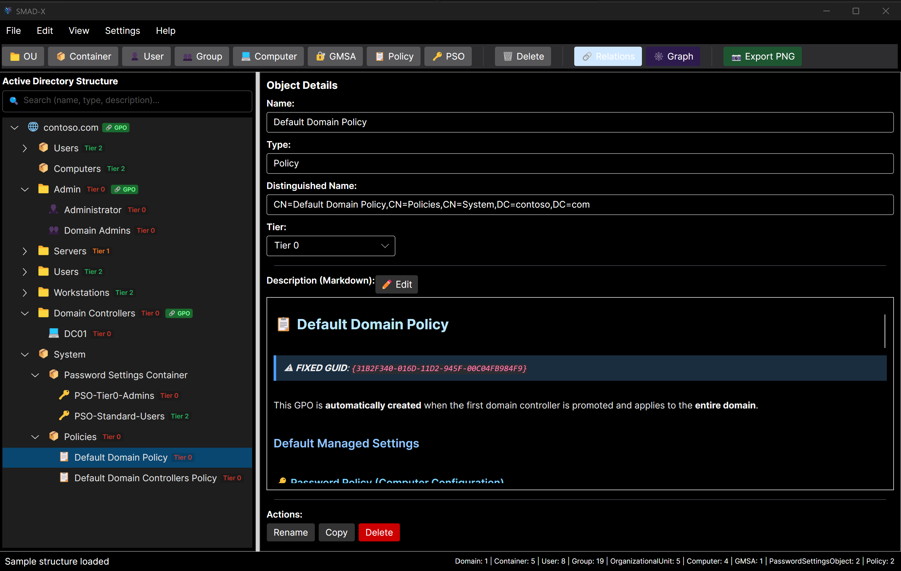
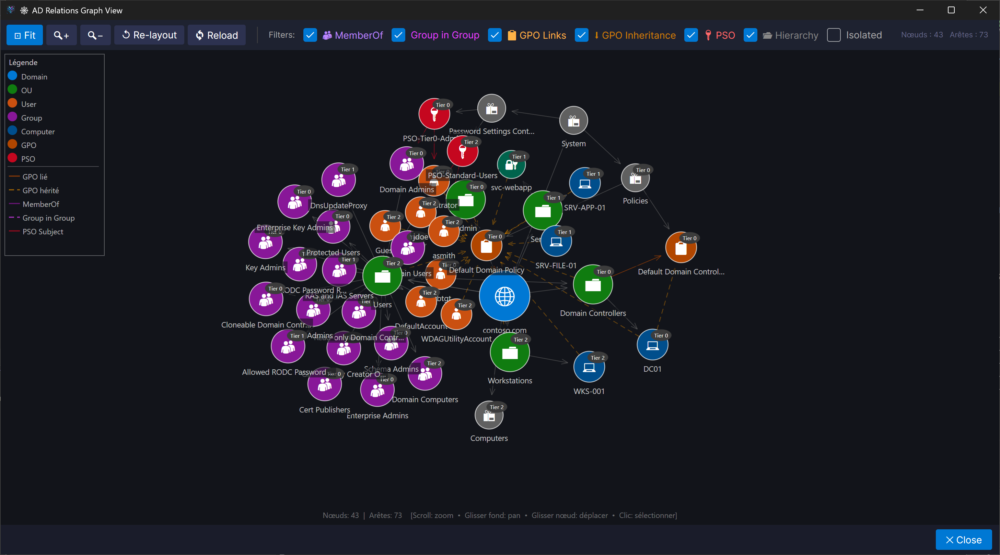

# SMAD-X — Expert Active Directory Simulator

<p align="center">
  
  
  
  
  
  
  
</p>

<p align="center">
  
</p>

<p align="center">
  
</p>

> 🇫🇷 La documentation en français est disponible dans [ReadmeFR.md](./ReadmeFR.md).

**SMAD-X** (*Simulate, Model and Audit Active Directory eXpert*) is an expert Active Directory simulator built with Avalonia UI and .NET 10. It generates an AD structure faithful to a fresh Windows Server installation and lets you visualize, document and export it without any real infrastructure.

---

## 🎯 Features

### 🏗️ Complete and Faithful Default AD Structure
- Automatic generation of all containers and objects present in a freshly promoted AD domain:
  - **Builtin**: Administrators, Users, Guests, Server Operators, Account Operators, Backup Operators…
  - **Users**: Administrator, Guest, krbtgt, DefaultAccount, WDAGUtilityAccount + 16 default domain groups (Domain Admins, Schema Admins, Enterprise Admins, Protected Users, Key Admins, Cloneable Domain Controllers, Denied/Allowed RODC Password Replication Group…)
  - **Computers**: default container for domain-joined workstations
  - **Domain Controllers** (OU): DC01 with all FSMO roles
  - **System**: Password Settings Container, Policies (Default Domain Policy, Default Domain Controllers Policy)
  - **ForeignSecurityPrincipals**
- Create a custom domain via `File > New Domain`
- Distinguished Names computed automatically

### 🌐 Interactive Relationship Graph
- Force-directed visualization of all relationships between objects
- Separate rendering of **User → Group** memberships and **Group → Group** nesting
- Filters by object type (User, Group, Computer, OU, GPO, PSO…) and by tier
- Pan, zoom and node selection

### 🔗 Relationship Management
- **User → Group**: dedicated tab to assign users to groups
- **Group → Group**: dedicated tab to manage group nesting (groups inside groups)
- **GPO**: Group Policy Object links to domains and OUs, with visual badge `🔗 GPO` in the tree
- **PSO**: Password Settings Object assignment to users and groups
- GPOs are created under `System\Policies` to match the real AD structure

### 📤 Export
- **Native JSON** (`.smadx.json`): full save and reload of the structure
- **PowerShell**: ready-to-deploy scripts to create the structure in a real AD
  - AD structure export (OUs, users, groups)
  - Linked GPOs export
  - PSOs export

### 🎨 Microsoft Tiering Model
- **Tier 0**: Domain controllers, critical accounts and systems
- **Tier 1**: Infrastructure and application servers
- **Tier 2**: Workstations and standard users
- Per-tier colors configurable through the UI

### 📝 Built-in Markdown Documentation
- Every object has a rich Markdown description with role and **security notes**
- Edit / Preview toggle
- Pre-filled and localized descriptions for all default objects including security posture

### 🌙 Light / Dark Theme
- Switch between Light and Dark themes at runtime — no restart required
- Native Avalonia FluentTheme — menus and popups always rendered in the correct theme

### 🔍 Live Search in Tree
- Search bar above the TreeView: filter nodes by **name**, **type** or **description**
- Non-matching nodes are hidden; parent nodes are automatically expanded
- Clear button to reset the filter instantly

### 🌍 Multilingual Support
- Full interface available in **French** and **English** — language switch at runtime

### ✅ Active Directory Validation
- Name validation following AD rules (forbidden characters, length, uniqueness)
- Container rules enforced (e.g. a Container can only hold CN objects, not OUs)

---

## 🚀 Quick Start

1. **Prerequisites**: .NET 10 SDK — Windows, macOS or Linux
2. **Build**: `dotnet build`
3. **Run**: `dotnet run --project SMAD-X/SMAD-X.csproj`

---

## 📖 Usage

### Default Structure on Startup
On launch, SMAD-X automatically loads a `contoso.com` domain with a complete AD structure faithful to a fresh Windows Server installation.

### Create a New Domain
`File > New Domain` → enter the FQDN (e.g. `corp.local`) and choose whether tiering should be assigned automatically.

### Add Objects
- Select a parent node in the tree
- Use the toolbar buttons: 📁 OU, 👤 User, 👥 Group, 💻 Computer, 🔑 GMSA…
- The object is created as a child of the selected node, with its DN computed automatically

### Copy / Paste

| Action | Shortcut |
|---|---|
| Copy an object (and its children) | `Ctrl+C` |
| Paste into the selected container | `Ctrl+V` |
| Delete | `Del` |

### Graph View
`View > Graph View`: force-directed visualization of all relationships.
Filter by object type or tier using the sidebar checkboxes.
Toggle **Group nesting** to display Group → Group edges separately.

### Relations Window
`View > Relations`: dedicated window with four tabs:

| Tab | Purpose |
|---|---|
| 👤 **User → Group** | Assign users to groups |
| 👥 **Group → Group** | Manage group nesting |
| 📋 **GPO Links → OU** | Link Group Policy Objects to OUs/Domain |
| 🔑 **PSO Subjects** | Assign Password Settings Objects |

### Save / Load

| Action | Menu |
|---|---|
| Save | `File > Save…` (`.smadx.json`) |
| Open | `File > Open…` |
| Export PowerShell (structure) | `File > Export PowerShell > AD Structure` |
| Export PowerShell (GPOs) | `File > Export PowerShell > GPOs` |
| Export PowerShell (PSOs) | `File > Export PowerShell > PSOs` |

---

## 🔐 Default Accounts & Groups — Security Reference

Every default object includes an in-app Markdown description with role and security guidance.

### 🔴 Tier 0 — Critical (Domain / Forest)

| Object | Type | Role | Key Security Points |
|---|---|---|---|
| **Administrator** | Account | Full domain access | Rename it, disable when not needed, monitor PtH / Mimikatz (Event 4624 type 3) |
| **krbtgt** | Account | Signs all Kerberos TGTs | Never delete/enable — Golden Ticket risk — rotate every 180 days (double rotation) |
| **Domain Admins** | Group | Full domain control | Keep minimal, use PAW, monitor Event 4728/4729 |
| **Enterprise Admins** | Group | Full forest control | Keep **empty** — add members only for forest-wide operations |
| **Schema Admins** | Group | Modify AD schema | Keep **empty** — schema changes are irreversible |
| **Domain Controllers** | Group | All domain controllers | A compromised DC = compromised domain |
| **Read-Only Domain Controllers** | Group | Contains RODCs | Manage Password Replication Policy carefully |
| **DnsAdmins** | Group | DNS administration | Privilege escalation via DLL injection (Shay Ber 2017 — Event 4662) |
| **Key Admins** | Group | Manage msDS-KeyCredentialLink | Shadow Credentials attack (Whisker / pyWhisker) |
| **Enterprise Key Admins** | Group | Key Admins, forest-wide scope | Shadow Credentials — forest scope — keep **empty** |
| **Cloneable Domain Controllers** | Group | DC cloning | Cloned DC inherits source DC secrets — control membership |

### 🟠 Tier 1 — Elevated Privileges

| Object | Key Risk |
|---|---|
| **Group Policy Creator Owners** | Malicious GPO deployment — monitor Event 5136/5137 |
| **Cert Publishers** | PKI escalation ESC1–ESC8 (Certify / Certipy) |
| **RAS and IAS Servers** | VPN/RADIUS interception if compromised |
| **DnsUpdateProxy** | DNS hijacking via ownerless DNS records |
| **Allowed RODC Replication** | Never place Tier 0 accounts here |

### 🟡 Tier 2 — Monitoring Required

| Object | Note |
|---|---|
| **Protected Users** | Add all Tier 0/1 accounts — blocks PtH, PtT, OverPtH, RC4, DES |
| **Denied RODC Replication** | Keep up-to-date with all critical accounts |
| **Domain Users** | Default group for all domain accounts — audit memberships |
| **Domain Computers** | All domain-joined machines — monitor unauthorized joins |

### 🟢 System / Low Risk

| Object | Note |
|---|---|
| **Guest** | Disabled by default since Server 2008 — do not enable |
| **DefaultAccount** | System account — do not modify |
| **WDAGUtilityAccount** | Windows Defender Application Guard — do not modify |

---

## 🎨 Microsoft Tiering Model

| Tier | Color | Scope |
|---|---|---|
| **Tier 0** | 🔴 Red | Domain controllers, critical accounts and systems |
| **Tier 1** | 🟠 Orange | Infrastructure and application servers |
| **Tier 2** | 🟢 Green | Workstations and standard users |

Colors are configurable via `Settings > Tier Configuration`.

---

## 🏗️ Architecture

```
SMAD-X/
├── Models/
│   ├── ADObject.cs                  # Core data model (DN, GPO, PSO, MemberOf…)
│   ├── ADObjectType.cs              # AD object type enumeration
│   ├── ADTreeNode.cs                # TreeView display node (GPO badge, tier color)
│   └── TierConfiguration.cs        # Tier color configuration
├── Services/
│   ├── ADDataService.cs             # Default structure, JSON save/load
│   ├── ADImportPowerShellService.cs # Import from PowerShell scripts
│   ├── ADPowerShellExportService.cs # Export to PowerShell scripts
│   ├── ADValidationService.cs       # Name validation and container rules
│   ├── LocalizationService.cs       # FR/EN multilingual support + security descriptions
│   └── ThemeService.cs              # Light/Dark theme management
├── ViewModels/
│   ├── MainWindowViewModel.cs       # Main ViewModel (MVVM)
│   ├── GraphViewModel.cs            # Graph view ViewModel
│   ├── RelationsViewModel.cs        # Relations ViewModel (User→Group, Group→Group, GPO, PSO)
│   └── TierConfigurationViewModel.cs
├── Views/
│   ├── MainWindow.axaml             # Main interface with GPO badge in tree
│   ├── GraphWindow.axaml            # Force-directed graph view
│   ├── RelationsWindow.axaml        # Relations window (4 tabs)
│   ├── NewDomainDialog.axaml        # New domain dialog
│   ├── TierConfigurationWindow.axaml
│   └── AboutDialog.axaml
├── Graph/
│   ├── GraphBuilder.cs              # Build graph from AD tree
│   ├── GraphCanvas.cs               # Avalonia graph renderer (zoom/pan/hit-test)
│   ├── GraphNode.cs / GraphEdge.cs  # Graph model
│   ├── GraphFilter.cs               # Type/tier/nesting filters
│   └── ForceSimulation.cs           # Force-directed algorithm
└── Converters/
	├── BoolToStringConverter.cs
	├── LocalizeConverter.cs
	└── MarkdownConverter.cs
```

---

## 🔧 Technologies

| Component | Version | Role |
|---|---|---|
| **.NET** | 10 | Cross-platform runtime |
| **Avalonia UI** | 12.0.3 | Cross-platform UI framework |
| **CommunityToolkit.Mvvm** | latest | MVVM implementation |
| **Markdig** | latest | Markdown rendering |
| **System.Text.Json** | built-in | JSON serialization |

---

## 📝 Use Cases

| Profile | Use Case |
|---|---|
| **Trainer / Student** | Learn and teach AD concepts without real infrastructure |
| **Administrator** | Document and audit an existing AD architecture |
| **Architect** | Design and validate a new AD structure before deployment |
| **Pentester / Red Team** | Visualize attack paths via group relations, tiers and default account security notes |
| **Integrator** | Generate ready-to-deploy PowerShell scripts |

---
<p align="center">
  
</p>


## 🎯 Roadmap

- [x] Complete default AD structure faithful to a fresh domain
- [x] Force-directed relationship graph view
- [x] GPO / PSO / MemberOf management
- [x] PowerShell export (structure, GPOs, PSOs)
- [x] Multilingual support FR/EN
- [x] Rich Markdown descriptions with security notes for all default accounts/groups
- [x] Import from a real Active Directory (via PowerShell)
- [x] Group nesting (Group → Group) in graph and relations
- [x] GPO visual badge in TreeView
- [x] Split Relations window: User → Group and Group → Group tabs
- [x] Avalonia upgrade to 12.0.3 (FluentTheme, performance improvements)
- [x] Light / Dark theme (native Avalonia FluentTheme)
- [x] Search and filtering in the tree (live search by name / type / description)
- [ ] Multi-domain / forest support

---

## 📄 License

This project is licensed under the **Creative Commons Attribution-NonCommercial 4.0 International (CC BY-NC 4.0)**.

[](https://creativecommons.org/licenses/by-nc/4.0/)

### ✅ You are free to
- **Share** — copy and redistribute the material in any medium or format
- **Adapt** — remix, transform, and build upon the material

### ⚠️ Under the following terms
- **Attribution** — You must give appropriate credit, provide a link to this repository, and indicate if changes were made.
  ```
  Based on SMAD-X — Expert Active Directory Simulator
  Original work: https://github.com/JM2K69/SMAD-X
  Copyright (c) 2025-2026 SMAD-X Project
  Licensed under CC BY-NC 4.0
  ```
- **NonCommercial** — You may not use this project for commercial purposes without explicit prior written permission.

See the full [LICENSE](./LICENSE) file for details.

---

> Inspired by [MockAD-Release](https://github.com/shokkadev/MockAD-Release) by shokkadev.

## 🤝 Contributing

Contributions are welcome! Feel free to open issues or pull requests.

## 👨‍💻 Author

**JM2K69**
